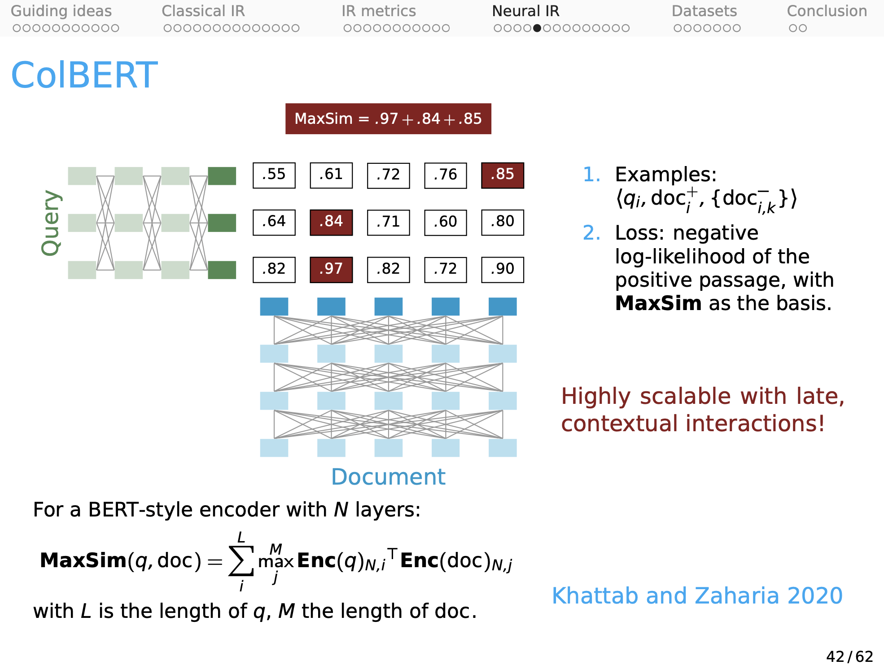

**Subject:** Re: XC224U: BM25S: Towards Efficient Context-Augmented Neural Information Retrieval System

* On **Nov 6, 2023**, at 5:22 PM, Igor Khomyakov <ikh@ikhsoftware.com> wrote to: Jonathan Michael Gomes Selman <jgs8@stanford.edu>; jonsaadfalcon@gmail.com <jonsaadfalcon@gmail.com>; keshav2@cs.stanford.edu <keshav2@cs.stanford.edu>; Matei Zaharia <matei@berkeley.edu>; Omar Khattab <okhattab@stanford.edu>; Petra Parikova <parikova@stanford.edu>; Christopher G. Potts <cgpotts@stanford.edu>

Dear All,

Firstly, I would like to extend a heartfelt thank you for the comprehensive course you've assembled. It has profoundly enriched my grasp of Natural Language Understanding. The depth and clarity of the material have not only educated but also inspired me. For this invaluable learning experience, I am truly thankful.

My work in this course drew inspiration from ColBERT—my gratitude goes to Omar, Matei, Christopher, Keshav, and Jon for their exceptional work. The core concept involves employing a Large Language Model like BERT in conjunction with Locality Sensitive Hashing function based on cosine similarity to convert input documents into a semantic domain that utilizes a fixed semantic vocabulary. This is then paired with the traditional BM25 model to process semantic tokens. Additionally, it performs classic BM25 on the input tokens and subsequently aggregates the two scores by applying a weight coefficient 'S.' This coefficient permits the user to modulate the emphasis between the input and semantic domains. For instance, setting S=0 favors a purely keyword-based search when precise terms are known. On the other hand, setting S=1 caters to searches by meaning when the exact terms are elusive. Values in between afford a blend of both approaches. Also I have introduced a metric termed "Failure MRR," which is calculated in the same manner as the positive MRR, but for the negative label—essentially gauging how high in the ranking the negative label appears. Attached, please find the diagram illustrating the model I have developed, which I refer to as BM25S ("S" stands for “semantic”). The source code published under GPLv3 that implements BM25S (Python + Sqlite3)  is available here: https://github.com/ikhomyakov/bm25s.

At 11:55 PM Pacific Time last Friday (5 minutes before the hard deadline), when I submitted my paper, I had managed to test 9,009 labeled queries from the MS MARCO passage dataset, consisting of query triples (query, positive passage, negative passage), with coefficient 'S' set at 0.5. The outcome was an MRR@10 of 0.45, which, to my belief, surpasses the benchmarks reported in the ColBERT publications. It is noteworthy that the BERT base cased model utilized had not undergone any fine-tuning. The results were impressively favorable.

Following the submission of the final paper, additional experiments with coefficient ’S’=1 revealed that the semantic component I had integrated did not perform well at all (MRR@10 of 0.01), which I suspect is attributable to the absence of fine-tuning and/or possibly an inappropriate choice of LSH function. Interestingly, when I excluded the semantic component by setting coefficient ’S’ to 0, the traditional BM25 algorithm alone yielded an even higher MRR@10 of 0.51. This leads me to ponder whether I might be miscalculating something or misinterpreting the results. Could this high MRR be a consequence of evaluating the algorithm only on the first 10,000 triples of the MS MARCO dataset, and might extending the evaluation to a larger document set result in a diminished performance?

I would greatly appreciate any advice you could provide. Please let me know if, in your opinion, this model warrants further investigation, or if other researchers have already thoroughly explored this approach with negative results. If my model indeed exhibits robust performance, I would posit that the only plausible explanation is the incorporation of BERT's tokenizer into the classic BM25 model. I am curious to ascertain whether this modification has indeed improved the performance of BM25, or if BM25 could achieve comparable results even without the BERT tokenization. To explore this hypothesis, I plan to conduct an experiment using a traditional word tokenizer.

Thank you once again for the exceptional course. I am looking forward to hearing from you!

Best regards, 

Igor Khomyakov
ikh@ikhsoftware.com 

Success and Failure MRR@10 yielded on first 10,000 queries/20,000 passages of MS MARCO passage triple train small dataset: 

| S    | MRR@10      | Failure MRR@10 |
| ---: |   ---:      |       ---:     |
| 0.00 | +0.507316786| -0.0945025     |
| 0.25 | +0.502162500| -0.0936017     |
| 0.50 | +0.452285317| -0.0705762     |
| 0.75 | +0.133958095| -0.0123081     |
| 1.00 | +0.006020397| -0.0007281     |

* On **Nov 7, 2023**, at 12:15 PM, Omar Khattab <okhattab@stanford.edu> wrote to Igor Khomyakov <ikh@ikhsoftware.com>:

Hey Igor,

Thanks for reaching out, this sounds very rich!

Two quick thoughts:
Your (surprising) observation that BERT performs really poorly (no matter how it's used) for retrieval is indeed correct. This has surprised us for a long time, but it is now a true accepted finding.

The reason for the high scores with BM25 in your testing (whose MRR@10 is supposed to be ~18%) is that you're evaluating on the triples. Evaluation should be done over the whole corpus (9M passages) for each query, not just a few negatives. The few passages that appear in the triple over-represent the "positive" passage. You're searching for the same needle (positives) in a much, much smaller haystack, so the search task is artificially easy.

Hope this helps!

--Omar

* On **Nov 14, 2023** 10:19 PM, Igor Khomyakov <ikh@ikhsoftware.com> wrote to Omar Khattab <okhattab@stanford.edu>:
 
Dear Omar, 

Thank you for your prompt reply and advice. 

Regarding your second point: when time allows, I plan to repeat my evaluations across the entire corpus of 9 million passages and will provide an update on the revised figures.

Concerning your first point, I am somewhat confused. I was under the impression that ColBERT, which is considered the state-of-the-art in retrieval, also utilizes the BERT model in a similar manner (as illustrated below): based on late interaction and cosine similarity in the embedding space. My intuition behind BM25S was that by replacing MaxSim with the combination of LSH and BM25 could yield comparable performance but with greater computational efficiency. However, your statement seems to suggest that regardless of the usage of BERT (be it BM25S or ColBERT, fine-tuned or not), its performance will be subpar.  Could you please confirm this? Also, if ColBERT is not the state-of-the-art in retrieval today, what is? 

In your opinion, could replacing the BERT transformer with another transformer model (such as RoBERTa or ELECTRA) potentially result in significant performance gains? Alternatively, consider if, in BM25S, we replaced BERT and LSH with a T5 encoder-decoder, fine-tuned it to translate into a new, "universal alien Esperanto of semantics," and then applied BM25 to this newly created semantic vocabulary. Do you think this approach has potential? 

Thank you once again for dedicating your time and attention to my questions. I greatly value your opinion and am eagerly anticipating your insights.

Best regards, 

Igor Khomyakov
ikh@ikhsoftware.com 

* On **Nov 15, 2023**, at 11:39 AM, Omar Khattab <okhattab@stanford.edu> wrote to Igor Khomyakov <ikh@ikhsoftware.com>:

Hey Igor,

Sorry my first bullet was ambiguous. BERT is great for retrieval if (and only if!) you finetune it. Using it off the shelf (frozen) performs very poorly, as you observed correctly in your initial email.

Replacing with RoBERTa or ELECTRA doesn't change that, as far as I know.

--Omar

* On **Nov 16, 2023**, at 12:30 PM, Igor Khomyakov <ikh@ikhsoftware.com> wrote to Omar Khattab <okhattab@stanford.edu>:

Hi Omar,

Thank you for the clarification! This aligns with what I suspected. Therefore, if I discover a method to fine-tune BERT for this model, BM25S could potentially achieve performance comparable to that of ColBERT. One approach to fine-tuning BM25S might involve utilizing the fine-tuning process of ColBERT, since both models rely on cosine similarity interactions of the embedding vectors. If you have a published fine-tuned BERT model for ColBERT, could you direct me to where I can download it to test this hypothesis? Additionally, if fine-tuned BM25S demonstrates performance comparable to ColBERT, do you think it would justify publishing a paper on BM25S?

Best regards, 

Igor 

